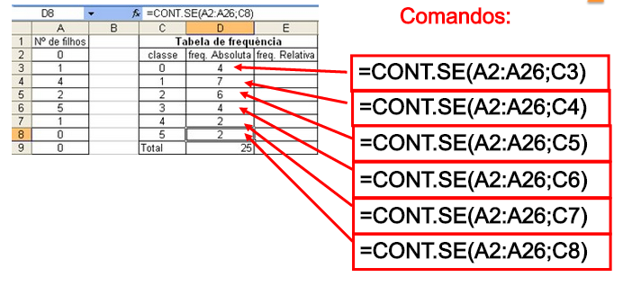

## Sobre o Curso


Instrutor: Lucas Mation, IPEA, Economista
Contato: lucasmation@gmail.com

Os materiais (dados) do curso estão disponíveis em:
https://github.com/lucasmation/Curso_Fundamentos_da_Estatistica

Slides serão disponibilizados após as aulas


## O que é ESTATISTICA?

Conjunto de técnicas para trabalhar com dados. Duas grandes áraeas:

### Estatística Descritiva

### Análise

## O que é ESTATISTICA?

### Estatística Descritiva  

- Coleta
    - Amostragem, Operacionalização
- Organização/Manipulação 
    - Softwares Estatísticos , Progamação
- Apresentação 
    - Graficos, tabelas com estatísticas descritivas

## O que é ESTATISTICA?
    
### Análise

* Inferência 

    - Estmimar características/parâmetros desconhecidos da população a partir de de dados amostrais
    
    - Previsão
    
    - Teste de Hopóteses
    
* Busca de causalidade 
    - corr $\neq$ causalidade!
    
    - Regressão: métodos que permitem controlar para variáveis observáveis 
    
    - Experimentos Naturais


## O que é ESTATISTICA?

Diagrama fundamental da Estatística


## O que é ESTATISTICA?

Fundamento empírico de diversas áreas.  

- Medicina
- Socilologia 
- Economia
- Epidemeologia
- Ciência Política
- Psicologia

~ Quanto menos "experimetal/laboratorial" é a ciência, maior é o uso da estatística
 
## O que é ESTATISTICA?

Diga as áreas da Estatística usadas nas seguintes aplicações? 

- Calculo do salário médio no Brasil 
    - Suponha dados censitários
    - Agora suponha dados amostrais. O que muda?
    - Há diferença salarial entre homens e mulheres?
    - Isso se deve a discriminação ou outros fatores?
    
- Previsão do tempo

- Efeito da corrupção no crescimento econômico


## Definições

- População: conjunto de todos os elementos de interesse

- Amostra: subconjunto de elementos da população

- Variável: atributo que descreve um elemento/indivíduo da população, podendo variar entre indivíduos

- Parâmetro: característica mensurável da pupulação (média, desvio padrão)

- Estatística: característica mensuráve da amostra


## Notação


- $\sum_{i=1}^{n} X_i$ : Somatório de $X_1$ a $X_n$ 

- $\mu$  :  Média populacional

- $\bar{x}$ : Média amostral

- $\sigma^2$, var(X) : Variância

- $\sigma$, std(X) , dp(X) :  Desvio Padrão   


## Notação


- $p\left({x}\right)$, $p_X\left({x}\right)$: probabilidade do evento $x$ ocorrer

- $p\left({a \mid b}\right)$ : prob. de a dado b

- $p\left({a \cup b}\right)$ : prob. de a OU b

- $p\left({a \cap b}\right)$ : prob. de a E b


## Tipos de Variável

Numéricas (quantitativas):

- Contínuas

- Inteiras

Categórica (qualitativa)

- Nomanial
  
    - Binária (Dicotomica)
  
- Ordinal

## Tipos de Variável

Vamos usar a base de dados  ex1_dados_pessoas.csv

```{r}
d <- read.csv2('data/ex1_dados_pessoas.csv')
d
```

## Tipos de Variável

```{r, echo=FALSE}
library(ggplot2)
ggplot(d, aes(N_filhos)) + geom_histogram() 
```


Classifique os tipos de variável da tabela acima

Note a classificação no Brasileirão do time de futebol de Fulana. O que ocorre? Por que?

## Dados e o computador

Investige as "entranhas"" do arquivo ex1_dados_pessoas.csv "internamente". 
(clicar com botão direito > abrir com > notepad ou wordpad)

qual o separador do arquivo? porque não vírgula?


## Minha 1a PNAD


Vamos olhar os microdados da PNAD

Visite: http://www.ibge.gov.br/ > populacao (sem clicar) > PNAD > microdados

Abra os microdados

Abra os dicionários importadores

Qual é a lógica?


## Minha 1a PNAD

Para facilitar o manuseio, já preparei o script de improtação dos dados. Veja no arquivo:   importa_dados_PNAD_2013.R

```{r}
#Importando o arquivo no R:
load('data/pnad2013_pes_mastigada.Rda')
# importando do CSV:
# pnad2013_pes <- read.csv2('data/pnad2013_pes_mastigada.Rda')
summary(pnad2013_pes)
```

## Tabelas de Fequência

Contam o número de observações de: 

 - categorias (categóricas) ou numéricas discretas
 
 - intervalos de números inteiros (ex: 0-9, 10-19, etc)

###Exercício: 

A partir dos dados em **ex1_dados_pessoas.csv**, crie a tabela de frequências da variável sexo.

- Primeiro faça "manualmente"


## Tabelas de Fequência

###Exercício: tabela de frequências

A partir dos dados em **ex1_dados_pessoas.csv**, crie a  da variável sexo.

- Tente replicar esta tabela usando o software (Excel Ou R) .Dicas:
    - No Excel: Você pode usar a função **=CONT.SE()** . Ou também uma Tabela Dinâmica
    - No R selecione a variável sexo com *pnad2013_pes$sexo*. Use a função *table()* 
- Tente adicionar a "frequencia relativa" (quantos % da amostra cada categoria representa) 
- Faça um gráfico de barras do resultado desta tabela

## Tabelas de Fequência

Solução No Excel: 

- =count.se()



## Tabelas de Fequência

Solução No R: 

```{r}
d <- read.csv2('data/ex1_dados_pessoas.csv')
table(d$Sexo)
#melhorando a formatação
as.data.frame(table(d$Sexo))
```


## Tabelas de Fequência

Solução No R: 

```{r}
barplot(table(d$Sexo))
```


## Tabelas de Fequência

Agora calcule a tabela de frequencia por raça com os dados da PNAD. 

Solução no Excel:

- uma saida seria replicar o que foi feito anteriormente (=cont.se())
- Outra possibilidade é uma tabela dinamica (demonstrar em aula)

## Tabelas de Fequência

Solução No R: 

```{r}
d <- read.csv2('data/pnad2013_pes_mastigada.csv')
as.data.frame(table(d$sexo))
```


## Histograma

```{r}
ggplot(pnad2013_pes, aes(idade)) + geom_histogram(binwidth = .5) 
```


## Histograma

Mudando a largura do intervalo (binwidth)
```{r}
ggplot(pnad2013_pes, aes(idade)) + geom_histogram(binwidth = 5) 
```

## Histograma

Mudando a largura do intervalo (binwidth)
```{r}
ggplot(pnad2013_pes, aes(idade)) + geom_histogram(binwidth = 10) 
```

## Histograma

Mudando a largura do intervalo (binwidth)
```{r}
ggplot(pnad2013_pes, aes(idade)) + geom_histogram(binwidth = 20) 
```

## Grafico de pontos (scatter plot)
```{r}
library(dplyr)
pnad2013_pes %>% filter(renda_total<10000) %>% ggplot(aes(y=renda_total,x=idade,, colour = sexo)) + geom_point()
```

## Grafico de pontos (scatter plot)
```{r}
pnad2013_pes %>% filter(renda_total<10000) %>% ggplot(aes(y=renda_total,x=idade,, colour = sexo)) + geom_point(alpha=0.5)


```


## Graficos e Tabelas: Formatação

Dicas de fomtação:

Gráfico de pizza? Não usar! [Veja aqui porque](http://darkhorseanalytics.com/blog/wp-content/uploads/2014/09/devourThePie3.gif)
 
Tabelas: preferencialmente sem cores e linhas internas, etc. [Bom exempolo aqui](http://urbandemographics.blogspot.co.uk/2014/08/how-to-make-your-tables-less-terrible.html)


## Medidas de Tendência Central


### Média

Populacional 

$$\mu = \frac{\sum_{i=1}^{N} X_i} {N}$$


Amostral

$$\bar{x} = \frac{\sum_{i=1}^{ {N}} X_i} {N}$$


## Medidas de Tendência Central

### Mediana

Valor do meio de uma lista ordenada de números.


### MOda: 

Valor mais comum de uma lista de números.

## Medidas de Tendência Central

Em um país com renda extremamente desigual, o que é maior, a média ou a mediana?

Encontre a moda dos salários no Brasil

```{r}
library(dplyr)
pnad2013_pes %>% filter(renda_total<10000) %>% ggplot(aes(renda_total)) + geom_histogram(binwidth =10) 
```

## Summary

```{r}
summary(pnad2013_pes) 
```


## Medidas de Dispersão


### Variância

Populacional: 
$$\sigma^2 = \frac{\sum_{i=1}^{N}(x_i - \mu)^2} {N}$$

Amostral: 
$$\S^2 = \frac{\sum_{i=1}^{\widetilde{N}}(x_i - \bar{x})^2} {\widetilde{N}-1}$$


## Medidas de Dispersão


### Desvios Padrão

Raiz quadrada da variância:   $\sigma = \sqrt{\sigma^2}$  , $\S = \sqrt{\S^2}$, respectivamente. Retoma a dimensionalidade da variável original. 

### Coeficiente de variação

$$cv=\frac{S} {\bar{x}} *100$$

## Medidas de Dispersão

## Graficos e Tabelas: Formatação

Dicas de fomatação:

Gráfico de pizza? Não usar! [Veja aqui porque](http://darkhorseanalytics.com/blog/wp-content/uploads/2014/09/devourThePie3.gif)
 
Tabelas: preferencialmente sem cores e linhas internas, etc. [Bom exempolo aqui](http://urbandemographics.blogspot.co.uk/2014/08/how-to-make-your-tables-less-terrible.html)


## Distribuição 

Distribuição dos valores de x

```{r, echo=FALSE, message=FALSE, cache=FALSE, warning=FALSE}
library(ggplot2)
dt <- data.frame(x=c(1:20000),y=rnorm(20000)+5)
dens <- density(dt$y)
df <- data.frame(x=dens$x, y=dens$y)
ggplot(df, aes(x,y)) + geom_line() + geom_ribbon(aes(ymin=0, ymax=y)) + scale_x_continuous()
```


## Percentis

Definição: Valor da variável abaixo do qual está certo percentual das observações. 

Percentis de interesse:

- 25%, 50% e 75%: tambem chamados de "quartis" pois dividem as observações quatro grupos
- 1% e 99% (ou 5% e 95%): permitem identificar valores aberrantes, discrepantes

## Percentis

O percentil 25%, também conhecido como 1o quartil

```{r, echo=FALSE, message=FALSE, cache=FALSE, warning=FALSE}
probs <- c(0.25)
quantiles <- quantile(dt$y, prob=probs)
x <- round(as.numeric(quantiles),digits=2)
df$quant <- factor(findInterval(df$x,quantiles))
ggplot(df, aes(x,y)) + geom_line() + geom_ribbon(aes(ymin=0, ymax=y, fill=quant)) + scale_x_continuous(breaks=x) + scale_fill_brewer(guide="none")
```

## Percentis

O percentil 50%, também conhecido como *mediana*

```{r, echo=FALSE, message=FALSE, cache=FALSE, warning=FALSE}
probs <- c(0.5)
quantiles <- quantile(dt$y, prob=probs)
x <- round(as.numeric(quantiles),digits=2)
df$quant <- factor(findInterval(df$x,quantiles))
ggplot(df, aes(x,y)) + geom_line() + geom_ribbon(aes(ymin=0, ymax=y, fill=quant)) + scale_x_continuous(breaks=x) + scale_fill_brewer(guide="none")
```

## Percentis

O percentil 75%, também conhecido como 3o quartil

```{r, echo=FALSE, message=FALSE, cache=FALSE, warning=FALSE}
probs <- c(0.75)
quantiles <- quantile(dt$y, prob=probs)
x <- round(as.numeric(quantiles),digits=2)
df$quant <- factor(findInterval(df$x,quantiles))
ggplot(df, aes(x,y)) + geom_line() + geom_ribbon(aes(ymin=0, ymax=y, fill=quant)) + scale_x_continuous(breaks=x) + scale_fill_brewer(guide="none")
```


## Percentis

"Amplitude inter quartil": intervalo entre o 1o e o 3o quartis

```{r, echo=FALSE, message=FALSE, cache=FALSE, warning=FALSE}
probs <- c(0.25 , 0.75)
quantiles <- quantile(dt$y, prob=probs)
x <- round(as.numeric(quantiles),digits=2)
df$quant <- factor(findInterval(df$x,quantiles))
ggplot(df, aes(x,y)) + geom_line() + geom_ribbon(aes(ymin=0, ymax=y, fill=quant)) + scale_x_continuous(breaks=x) + scale_fill_brewer(guide="none")
```

## Percentis

Outliers: percentis 1%  e 99% 
```{r, echo=FALSE, message=FALSE, cache=FALSE, warning=FALSE}
probs <- c(0.01, 0.99)
quantiles <- quantile(dt$y, prob=probs)
x <- round(as.numeric(quantiles),digits=2)
df$quant <- factor(findInterval(df$x,quantiles))
ggplot(df, aes(x,y)) + geom_line() + geom_ribbon(aes(ymin=0, ymax=y, fill=quant)) + scale_x_continuous(breaks=x) + scale_fill_brewer(guide="none")
```

## Percentis

Outliers: percentis 1%  e 99% 
```{r, echo=FALSE, message=FALSE, cache=FALSE, warning=FALSE}
probs <- c(0.01, 0.99)
quantiles <- quantile(dt$y, prob=probs)
x <- round(as.numeric(quantiles),digits=2)
df$quant <- factor(findInterval(df$x,quantiles))
ggplot(df, aes(x,y)) + geom_line() + geom_ribbon(aes(ymin=0, ymax=y, fill=quant)) + scale_x_continuous(breaks=x) + scale_fill_brewer(guide="none")
```


### Percentis
```{r, echo=FALSE, message=FALSE}
dt <- data.frame(x=c(1:200),y=rnorm(200))
dens <- density(dt$y)
df <- data.frame(x=dens$x, y=dens$y)
probs <- c(0.01, 0.05, 0.1, 0.25, 0.5, 0.75, 0.9, 0.95, 0.99)
quantiles <- quantile(dt$y, prob=probs)
df$quant <- factor(findInterval(df$x,quantiles))
ggplot(df, aes(x,y)) + geom_line() + geom_ribbon(aes(ymin=0, ymax=y, fill=quant)) + scale_x_continuous(breaks=quantiles) + scale_fill_brewer(guide="none")
```

## Medidas de Dispersão


### Amplitude

Diferença entre o menor e maior valor da variável. 


### Amplitude inter-quartil

Diferença entre o o 1o e 3o quartis. 
Após ordenar a variável, computar o percentil 


## Amostragem

Tipos de Amostras:

- Probabilistica/Aleatória
    - Simples
        - Sistemática
    - Conglomerada
    - Esrtatificada
- Não Probabilístia
    - Por Cotas
    - Por Conveniencia(voluntária)


## Amostragem

Vamos discutir os tipos de amostras nestes 3 tipos de pesquisa:

PNAD
CENSO Demográfico (questionário detalhado)
Pesquisas Eleitorais


## Notação

- N: tamanho da população
- n: tamanho da amostra
- $f=\frac{n} {N}$ : fração amostral

Como determinar *n* ?

$$n=(\frac{z'*\sigma} {MDE})^2$$

Onde: 

- z' : limintes dos intervalos de confiança
- $\sigma$ : desvio padrão populacional. Estimado pelo desvio padrão encontrado no pré-teste, ou pesquisas anteriores 
- MDE: margen de erro
